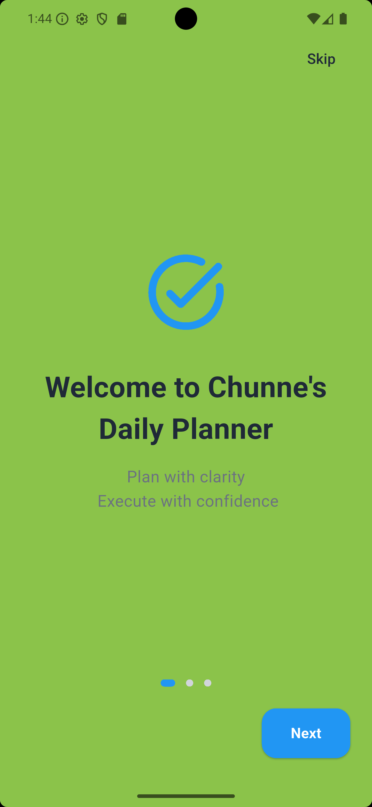
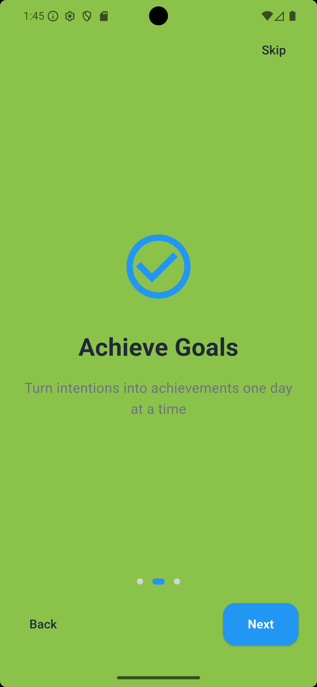
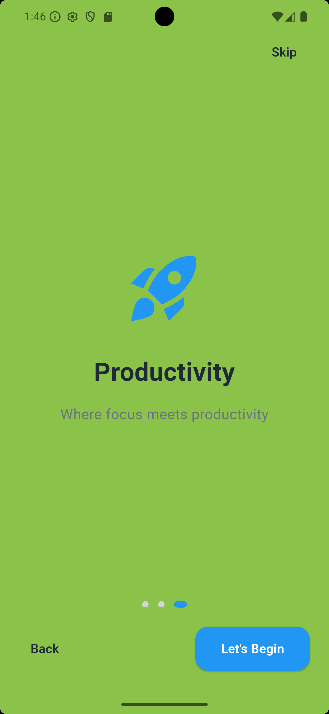
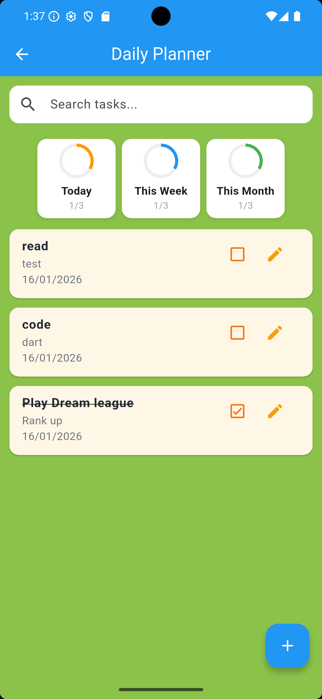
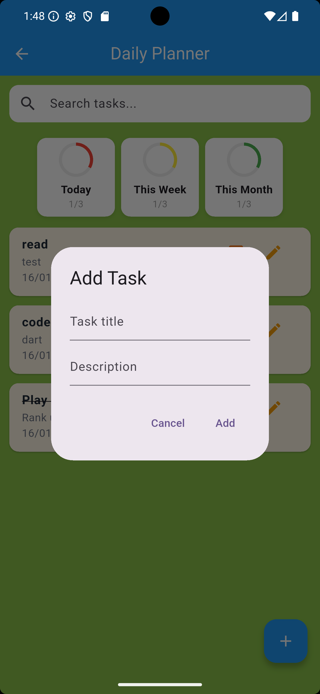
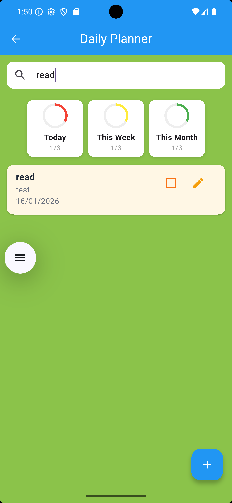

# Chunne Daily Planner App (Flutter)

A simple **Daily Planner mobile application** built with **Flutter** as a class project.  
The app helps users organize daily tasks, track progress, and stay productive using a clean and user-friendly interface.

---

## Chunne's Daily Planner App Features

- **Intro / Onboarding Screens**
    - Three swipeable introduction screens
    - Skip and Get Started navigation

- **Task Management**
    - Add, edit, and delete tasks
    - Mark tasks as completed (strike-through effect)
    - Optional task description
    - Automatic date tracking

- **Search Functionality**
    - Search tasks by title or description

- **Progress Dashboard**
    - Daily, weekly, and monthly task progress
    - Visual circular progress indicators

- **Local Storage**
    - Tasks are stored locally using Hive
    - Data persists after app restart

---
### 📱 Screenshots

#### Intro Screens
| Screen 1 | Screen 2 | Screen 3 |
|---------|---------|---------|
|  |  |  |

#### Main Screens
| Tasks Page | Add / Edit Task |
|-----------|----------------|
|  |  |

| Search Task                               |
|-------------------------------------------|
|  | 

---

---

##  How the App Works

1. The app opens with **three intro screens** explaining the app.
2. Users proceed to the **Tasks Page**.
3. Tasks can be added, edited, or marked as completed.
4. The dashboard automatically tracks progress:
    - Today
    - This Week
    - This Month
5. All data is saved locally using Hive.

---

